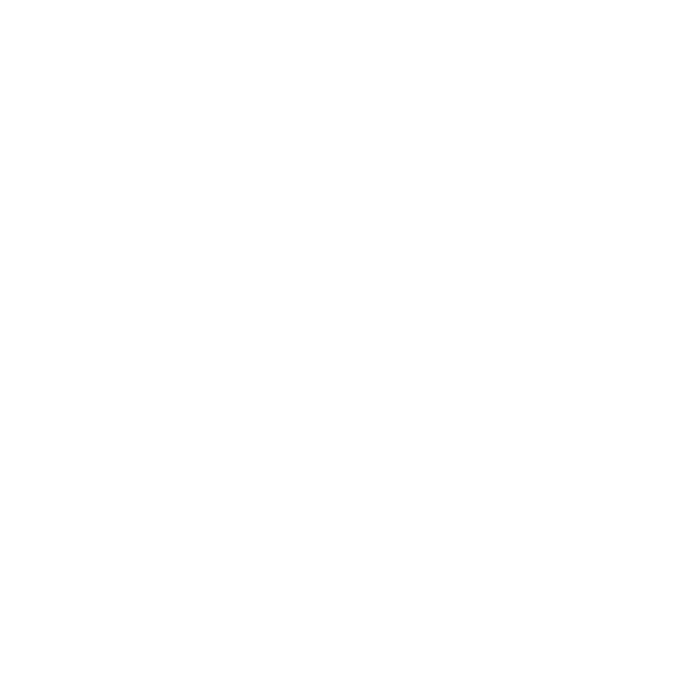

<p align="center"></p>

# purr.

purr. es una red social hecha por gatos

## Instalación

### Frontend

```bash
cd purr.frontend
npm install
```

### Image Engine

```bash
cd purr.imageEngine
python -m venv .venv
. .venv\bin\activate    # .\.venv\Scripts\activate en Windows
pip install -r requirements.txt
```
